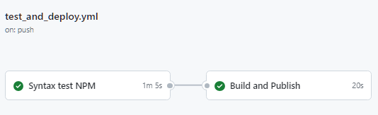
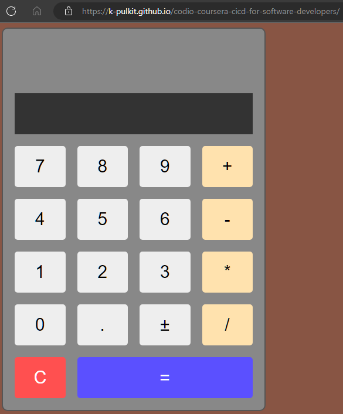

# codio-coursera-cicd-for-software-developers
Repository to learn and practice CI/CD processes using Github workflows, as guided in Coursera Course https://www.coursera.org/learn/codio-cicd-for-software-developers/

Access the deployed application at - https://k-pulkit.github.io/codio-coursera-cicd-for-software-developers/

The main workflow name is workflow/test_and_deploy which implements the following:

   1. Tests the code
   2. Compiles the code
   3. Builds the code
   4. Deploys to github pages

## Workflow

## Deployed APP

